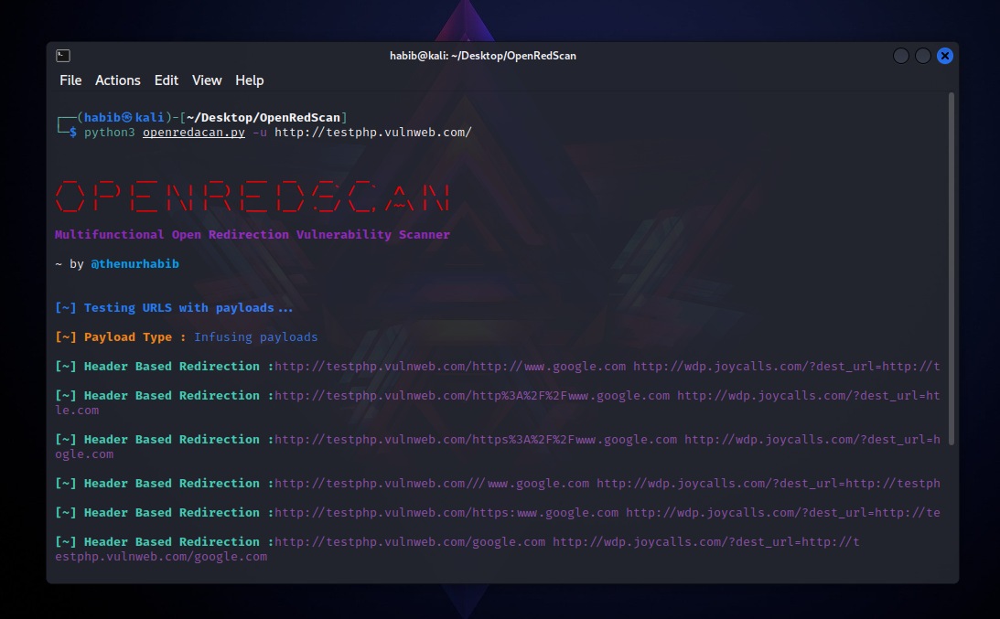

<h1 align="center">
  <br>
  <a  href="https://github.com/thenurhabib/openredscan"></a>
  <br>
  openRedScan
  <br>
</h1>

<h4 align="center">Multifunctional open redirection vulnerability scanner.</h4>

<br>

<p align="center">
  <a href="https://github.com/thenurhabib/openredscan/releases">
    
  </a>
  <a href="https://travis-ci.com/thenurhabib/openredscan">
    
  </a>
  <a href="https://github.com/thenurhabib/openredscan/issues?q=is%3Aissue+is%3Aclosed">
      
  </a>
</p>

<br>



<hr>

### openRedScan is a python based tool that can test every single URL and check for open redirection vulnerability.

<br>

### Main Features
- Header Based redirection
- Javascript Based redirection
- Meta Tag Based redirection

<br>

### Documentation
### install
```yaml
git clone https://github.com/thenurhabib/openredscan.git
cd openredscan
bash setup.sh
python3 openredscan.py -h
```


#### Usage

```yaml
┌──(habib㉿kali)-[~/Desktop/OpenRedScan]
└─$ python3 openredacan.py -h                                    


 __   __   ___       __   ___  __   __   __            
/  \ |__) |__  |\ | |__) |__  |  \ /__` /  `  /\  |\ | 
\__/ |    |___ | \| |  \ |___ |__/ .__/ \__, /~~\ | \|

Multifunctional Open Redirection Vulnerability Scanner

~ by @thenurhabib

usage: Help Menu

optional arguments:
  -h, --help  show this help message and exit
  -u URL      Domain Name.
  -l PATH     Multiple targets. (Ex: domains.txt)
  -crlf       Scan CRLF Injection.
  -p PAYLOAD  Use payloads file.
  --proxy     use proxy
  --wayback   fetch URLs from waybackmachine
                                                                                        
```
<br>


<br>


### Author
```yaml
Name       : Md. Nur habib
Medium     : thenurhabib.medium.com
Twitter    : https://twitter.com/thenurhab1b
HackerRank : https://www.hackerrank.com/thenurhabib

```

##### Thank You.
